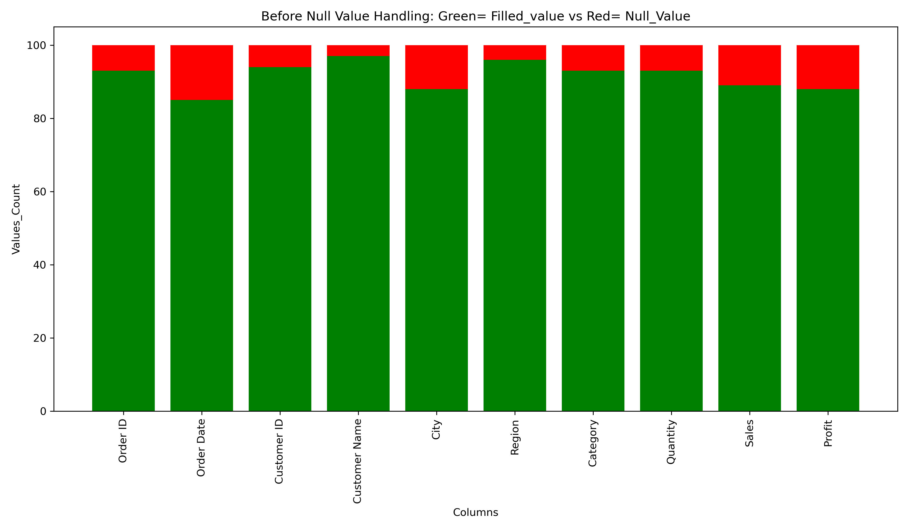
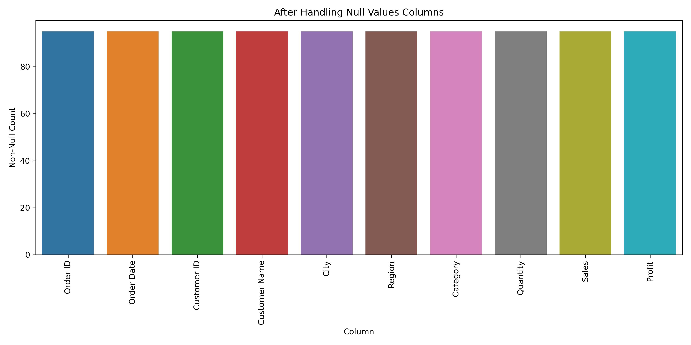
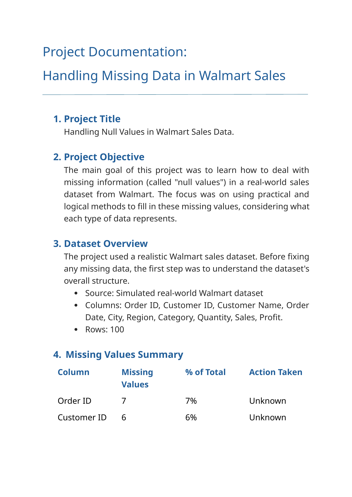
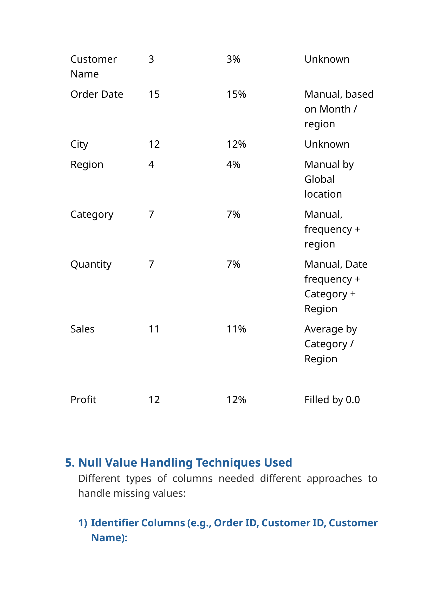
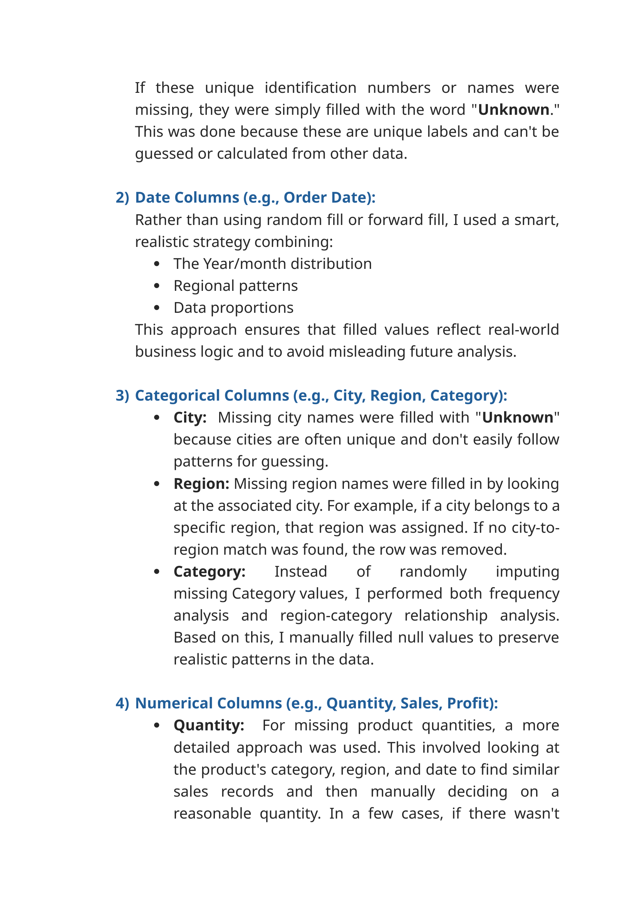
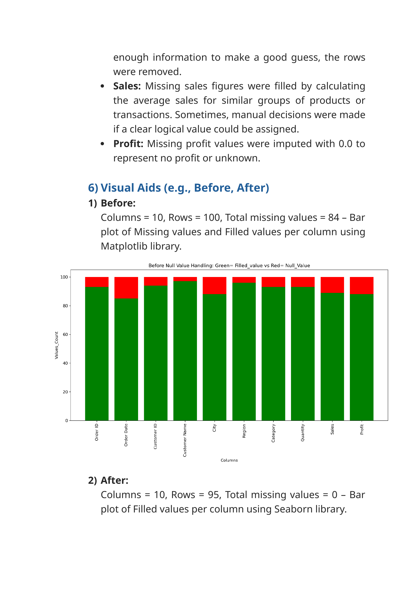
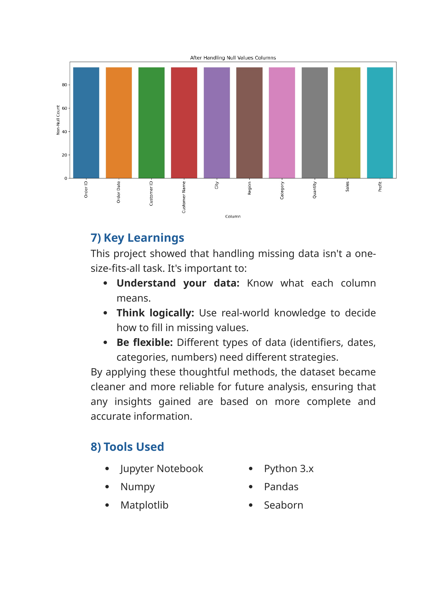

# 🛒 Walmart Null Value Handling - Full Project Journal

# <b> Handling Null Values in Different Columns

### <b> Objective :

#### *This is a realistic Walmart sales dataset. In this project, I aim to handle the missing (null) values using practical, real-world logic based on the type and context of each column.*
### Part 1:
- #### *Import the necessary libraries and dataset, then analyze the structure and quality of the data.*
### Part 2:
- #### *Apply appropriate real-world logic to impute.*
### Part 3:
- #### *Plot the chart before and after handling null values, Final summary.*

# <b> PART - 1

### <b> Import the librarys and Dataset :

```python
import numpy as np
import pandas as pd
import matplotlib.pyplot as plt
import seaborn as sns
```

```python
df = pd.read_csv(r"D:\B_Data_Anlysist_Project\Python_Projects\01_Handling_Null_Value\walmart_sales_with_nulls_value_dataset.csv")
df.head()
```

```python
df.shape
```

```python
df.info()
```

```python
df.isnull().sum()
```

### <b> Dataset Analysis :

#### *The dataset contains 10 columns and 100 rows. Based on the data types and usage, I’ve categorized the columns into 4 types:*
- #### <b> Identifiers columns :
    - ##### Order ID - 93 filled values & 7 null values, 
    - ##### Customer ID - 94 filled values & 6 null values, 
    - ##### Customer Name - 97 filled values & 3 null values.
- #### <b> Dates columns :
    - ##### Order Date - 85 filled values & 15 null values.
- #### <b> Categorical columns :
    - ##### City - 88 filled values & 12 null values, 
    - ##### Region - 96 filled values & 4 null values, 
    - ##### Categor - 93 filled values & 7 null values.
- #### <b> Numerical columns :
    - ##### Quantity - 93 filled values & 7 null values, 
    - ##### Sales - 89 filled values & 11 null values, 
    - ##### Profit - 88 filled values & 12 null values.

# <b> PART - 2

### <b> *1 - Handling the Identifiers columns :*

```python
df_copy = pd.DataFrame(df)
df_copy.head()
```

#### <b> 1 - Handling the Order ID column :
- ##### *Type: Object*
- ##### *Fill_values: 93*
- ##### *Null_values: 7*

```python
df_copy["Order ID"].info()
```

```python
df_copy["Order ID"].isnull().sum()
```

```python
df_copy[df_copy["Order ID"].isnull()]
```

```python
df_copy["Order ID"] = df_copy["Order ID"].fillna("Unknown")
```

```python
df_copy[df_copy["Order ID"] == "Unknown"]
```

#### <b> Order ID column Analysis :

#### <b> *Step - 1 :*
##### I am looking for any same order id is there in the column. All 93 order are having a unique id.
#### <b> *Step - 2 :*
##### Placing every order create unique Order ID. So, there is no possible to relate with any columns to fill the relative data for the missing value.
#### <b> *Conclusion :*
##### Since the Order IDs are unique and there’s no meaningful logic to derive the missing values from other columns, I have filled the null values with the placeholder `"Unknown"` to retain row integrity without creating misleading data.

```python
df_copy["Order ID"].info()
```

#### <b> 2 - Handling the Customer ID column :
- ##### *Type: Object*
- ##### *Fill_values: 94*
- ##### *Null_values: 6*

```python
df_copy["Customer ID"].nunique()
```

```python
df_copy["Customer ID"].info()
```

```python
df_copy[df_copy["Customer ID"].isnull()]
```

```python
df_copy["Customer ID"] = df_copy["Customer ID"].fillna("Unknown")
```

```python
df_copy[df_copy["Customer ID"] == "Unknown"]
```

#### <b> Customer ID column Analysis :

#### <b> *Step - 1 :*
##### Checked for duplicate or repeated customer IDs to see if any customers placed multiple orders.
##### Result: All 94 customer IDs are unique.
#### <b> *Conclusion :*
##### Since each customer is unique, there is no way to infer the missing values from other rows or columns. Therefore, I filled the null values with the placeholder `"Unknown"` to retain row integrity without creating misleading assumptions.

```python
df_copy["Customer ID"].info()
```

#### <b> 3 - Handling the Customer Name column :
- ##### *Type: Object*
- ##### *Fill_values: 97*
- ##### *Null_values: 3*

```python
df_copy["Customer Name"].nunique()
```

```python
df_copy["Customer Name"].info()
```

```python
df_copy[df_copy["Customer Name"].isnull()]
```

```python
df_copy["Customer Name"] = df_copy["Customer Name"].fillna("Unknown")
```

```python
df_copy[df_copy["Customer Name"] == "Unknown"]
```

#### <b> Customer Name column Analysis :

#### <b> *Step - 1 :*
##### Checked for duplicate or repeated customer names to see if any customers placed multiple orders.
##### Result: All 97 customer names are unique.
#### <b> *Step - 2 :*
##### Tried to relate Customer Name with Customer ID, but since all Customer IDs are also unique (except 6 missing), no reliable grouping or mapping is possible.
#### <b> *Conclusion :*
##### As all customer names are unique and cannot be related to other identifiers, I filled the null values with the placeholder "Unknown" to preserve data consistency.
#### <b> *Why i did not use Forward Fill :*
##### While forward fill is a valid approach, it can cause misleading data in this case.

```python
df_copy["Customer Name"].info()
```

```python
df_copy[["Order ID", "Customer ID", "Customer Name"]].info()
```

### <b> *2 - Handling the Dates columns :*

```python
df_date = pd.DataFrame(df_copy)
df_date.head()
```

#### <b> 1 - Handling the Order Date column :
- ##### *Type: Object*
- ##### *Fill_values: 85*
- ##### *Null_values: 15*

```python
df_date["Order Date"] = pd.to_datetime(df_date["Order Date"], dayfirst= True)
```

```python
df_date.head()
```

```python
df_date["Year"] = df_date["Order Date"].dt.year
```

```python
df_date.head()
```

```python
df_date["Month"] = df_date["Order Date"].dt.month
```

```python
df_date.head()
```

```python
df_date[(df_date["Year"] == 2023) & (df_date["Month"] == 7)].count()
```

```python
df_date[(df_date["Year"] == 2023) & (df_date["Month"] == 8)].count()
```

```python
df_date[(df_date["Year"] == 2023) & (df_date["Month"] == 9)].count()
```

```python
df_date[(df_date["Year"] == 2023) & (df_date["Month"] == 10)].count()
```

```python
df_date[(df_date["Year"] == 2023) & (df_date["Month"] == 11)].count()
```

```python
df_date[(df_date["Year"] == 2023) & (df_date["Month"] == 12)].count()
```

```python
df_date[(df_date["Year"] == 2024) & (df_date["Month"] == 1)].count()
```

```python
df_date[(df_date["Year"] == 2024) & (df_date["Month"] == 2)].count()
```

```python
df_date[(df_date["Year"] == 2024) & (df_date["Month"] == 3)].count()
```

```python
df_date[(df_date["Year"] == 2024) & (df_date["Month"] == 4)].count()
```

```python
df_date[(df_date["Year"] == 2024) & (df_date["Month"] == 5)].count()
```

```python
df_date[(df_date["Year"] == 2024) & (df_date["Month"] == 6)].count()
```

```python
df_date[(df_date["Year"] == 2024) & (df_date["Month"] == 7)].count()
```

```python
df_date[(df_date["Year"] == 2024) & (df_date["Month"] == 8)].count()
```

```python
df_date[(df_date["Year"] == 2024) & (df_date["Month"] == 9)].count()
```

```python
df_date[(df_date["Year"] == 2024) & (df_date["Month"] == 10)].count()
```

```python
df_date[(df_date["Year"] == 2024) & (df_date["Month"] == 11)].count()
```

```python
df_date[(df_date["Year"] == 2024) & (df_date["Month"] == 12)].count()
```

```python
df_date[(df_date["Year"] == 2025) & (df_date["Month"] == 1)].count()
```

```python
df_date[(df_date["Year"] == 2025) & (df_date["Month"] == 2)].count()
```

```python
df_date[(df_date["Year"] == 2025) & (df_date["Month"] == 3)].count()
```

```python
df_date[(df_date["Year"] == 2025) & (df_date["Month"] == 4)].count()
```

```python
df_date[(df_date["Year"] == 2025) & (df_date["Month"] == 5)].count()
```

```python
df_date[(df_date["Year"] == 2025) & (df_date["Month"] == 6)].count()
```

```python
df_per = df_date.groupby("Year").agg({"Month" : "count"})/df_date["Year"].count()*100
```

```python
round(df_per)
```

```python
df_date[df_date["Order Date"].isnull()]
```

```python
df_date.at[6, "Order Date"] = "01-01-2024"
```

```python
df_date.at[89, "Order Date"] = "20-04-2024"
```

```python
df_date.at[10, "Order Date"] = "15-02-2024"
```

```python
df_date.at[74, "Order Date"] = "12-11-2024"
```

```python
df_date.at[12, "Order Date"] = "16-12-2024"
```

```python
df_date.at[45, "Order Date"] = "11-04-2024"
```

```python
df_date.at[43, "Order Date"] = "23-09-2024"
```

```python
df_date.at[62, "Order Date"] = "01-10-2024"
```

```python
df_date.at[19, "Order Date"] = "30-08-2023"
```

```python
df_date.at[26, "Order Date"] = "13-07-2023"
```

```python
df_date.at[36, "Order Date"] = "28-10-2023"
```

```python
df_date.at[48, "Order Date"] = "01-08-2023"
```

```python
df_date.at[53, "Order Date"] = "24-02-2025"
```

```python
df_date.at[57, "Order Date"] = "15-05-2025"
```

```python
df_date.at[99, "Order Date"] = "23-01-2025"
```

```python
df_date.iloc[[6,10,12,19,26,36,43,45,48,53,57,62,74,89,99]]
```

```python
df_date.drop("Year", axis= 1, inplace= True)
```

```python
df_date.drop("Month", axis= 1, inplace= True)
```

```python
df_date.head()
```

#### <b> Order Date column Analysis :

#### <b> *Step - 1 :*
##### Converted `"Order Date"` from object to datetime64[ns] using:
##### `df_date["Order Date"] = pd.to_datetime(df_date["Order Date"], dayfirst= True)`

#### <b> *Step - 2 :*
##### Extracted `Year` and `Month` to analyze time-based distribution:
##### `df_date["Year"] = df_date["Order Date"].dt.year`
##### `df_date["Month"] = df_date["Order Date"].dt.month`

#### <b> *Step - 3 :*
##### Analyzed monthly data distribution per year:
- ##### 2023 – 24 values → spread across July to December
- ##### 2024 – 41 values → full-year distribution
- ##### 2025 – 20 values → Jan to June only
##### `df_date[(df_date["Year"] == 2025) & (df_date["Month"] == 1)].count()`

#### <b> *Step - 3 :*
##### Analyzed monthly data distribution per year:
- ##### 2023 – 24 values → spread across July to December
- ##### 2024 – 41 values → full-year distribution
- ##### 2025 – 20 values → Jan to June only
##### `df_date[(df_date["Year"] == 2025) & (df_date["Month"] == 1)].count()`

#### <b> *Step - 4 :*
##### Analyzed Region-wise breakdown for each year to match nulls with similar patterns.

#### <b> *Step - 5 :*
##### Calculated percentage of data filled per year:
##### `df_date.groupby("Year").agg({"Month" : "count"})/df_date["Year"].count()*100`
- ##### 2023 → 28%
- ##### 2024 → 48%
- ##### 2025 → 24%
##### Used this as a guideline to decide how many nulls to fill from each year.

#### <b> *Step - 6 :*
##### Identified remaining rows with null "Order Date" and used Region column to match realistic values.

#### <b> *Step - 7 :*
##### Filled 15 nulls using .at[], choosing existing date patterns (Year + Month + Region).
##### Example:
##### `df_date.at[99, "Order Date"] = "2025-01-23"`
- ##### 8 values from 2024 (most frequent year)
- ##### 4 values from 2023
- ##### 3 values from 2025

#### <b> *Step - 8 :*
##### Dropped the helper columns:
##### df_date.drop("Year", axis= 1, inplace= True)
##### df_date.drop("Month", axis= 1, inplace= True)

#### <b> *Conclusion :*
##### Rather than using random fill or forward fill, I used a smart, realistic strategy combining:
- ##### Year/month distribution
- ##### Regional patterns
- ##### Data proportions
##### This approach ensures that filled values reflect real-world business logic and don’t mislead future analysis.

```python
df_date["Order Date"].info()
```

### <b> *3 - Handling the Categorical columns :*

```python
df_cat = pd.DataFrame(df_date)
df_cat.head()
```

#### <b> 1 - Handling the City column :
- ##### *Type: Object*
- ##### *Fill_values: 88*
- ##### *Null_values: 12*

```python
df_cat["City"].info()
```

```python
df_cat["City"].nunique()
```

```python
df_cat["City"].isnull().sum()
```

```python
df_cat[df_cat["City"].isnull()]
```

```python
df_cat["City"] = df_cat["City"].fillna("Unknown")
```

```python
df_cat[df_cat["City"] == "Unknown"]
```

#### <b> City column Analysis :

#### <b> *Step - 1 :*
##### Checked Upon reviewing the `City` column, I found that all 88 filled values are unique — no city names are repeated across the dataset. Due to this uniqueness, there is no meaningful way to relate or group missing values with other categorical columns such as Region or Categorie.
#### <b> *Conclusion :*
- ##### In this scenario, using `'Unknown'` to fill the 12 missing city values is the most appropriate and logical choice.
- ##### Using `'Unknown'` ensures data integrity without distorting analytical results.
#### <b> *Why i did not use ffill or bfill :*
##### Techniques like forward fill (ffill) or backward fill (bfill) would introduce unrelated or incorrect city names, leading to potential misinterpretation of the data.

```python
df_cat["City"].info()
```

#### <b> 2 - Handling the Region column :
- ##### *Type: Object*
- ##### *Fill_values: 96*
- ##### *Null_values: 4*

```python
df_cat["Region"].info()
```

```python
df_cat["Region"].isnull().sum()
```

```python
df_cat["Region"].unique()
```

```python
df_cat.groupby("Region").agg({"Region" : "count"})
```

```python
df_cat[df_cat["Region"].isnull()]
```

```python
df_cat.drop(index= 64, inplace= True)
```

```python
df_cat[df_cat["Region"].isnull()]
```

```python
df_cat.at[35,"Region"] = "West"
```

```python
df_cat.at[54,"Region"] = "West"
```

```python
df_cat.at[84,"Region"] = "South"
```

```python
df_cat.iloc[[35,54,83]]
```

#### <b> Region column Analysis :

#### <b> <font color= #ABFF00> *Step - 1 : Initial Investigation*
- ##### The Region column contains 4 null values at index positions 35, 54, 64, 84.
- ##### The regions are categorized into four parts: East, West, Central, and South.
#### <b> *Step - 2 : Analyzing Using the City Column*
- ##### Index 35: City = South James - Located in the United States, belongs to the West region.
- ##### Index 54: City = West Maryville - Located in Canada, which is grouped into the West region (as per U.S.-Canada mapping logic).
- ##### Index 84: City = Port Joshuastad - Located in South Africa, which is mapped to the South region in global context.
#### <b> *Step - 3 : Dropping the Useless Row*
- ##### Index 64:
    - ##### All major numeric fields like Sales, Profit, and Discount were missing.
    - ##### Since the row provides no useful data and can't be meaningfully imputed, it was dropped.
#### <b> *Conclusion :*
##### In this case, the City column provided strong geographic signals to accurately fill the Region column's missing values. The method used was manual but precise, and the logic was backed by actual geographic references.

```python
df_cat["Region"].info()
```

#### <b> 3 - Handling the Category column :
- ##### *Type: Object*
- ##### *Total_Rows: 99*
- ##### *Fill_values: 92*
- ##### *Null_values: 7*

```python
df_cat["Category"].info()
```

```python
df_cat["Category"].isnull().sum()
```

```python
df_cat["Category"].unique()
```

```python
df_cat.groupby("Category").agg({"Region" : "count"})
```

```python
df_cat[(df_cat["Category"] == "Furniture") & (df_cat["Region"] == "Central")].count()
```

```python
df_cat[(df_cat["Category"] == "Furniture") & (df_cat["Region"] == "South")].count()
```

```python
df_cat[(df_cat["Category"] == "Furniture") & (df_cat["Region"] == "East")].count()
```

```python
df_cat[(df_cat["Category"] == "Furniture") & (df_cat["Region"] == "West")].count()
```

```python
df_cat[(df_cat["Category"] == "Office Supplies") & (df_cat["Region"] == "Central")].count()
```

```python
df_cat[(df_cat["Category"] == "Office Supplies") & (df_cat["Region"] == "South")].count()
```

```python
df_cat[(df_cat["Category"] == "Office Supplies") & (df_cat["Region"] == "East")].count()
```

```python
df_cat[(df_cat["Category"] == "Office Supplies") & (df_cat["Region"] == "West")].count()
```

```python
df_cat[(df_cat["Category"] == "Technology") & (df_cat["Region"] == "Central")].count()
```

```python
df_cat[(df_cat["Category"] == "Technology") & (df_cat["Region"] == "South")].count()
```

```python
df_cat[(df_cat["Category"] == "Technology") & (df_cat["Region"] == "East")].count()
```

```python
df_cat[(df_cat["Category"] == "Technology") & (df_cat["Region"] == "West")].count()
```

```python
df_cat[df_cat["Category"].isnull()]
```

```python
df_cat.at[11, "Category"] = "Furniture"
```

```python
df_cat.at[3, "Category"] = "Furniture"
```

```python
df_cat.at[49, "Category"] = "Furniture"
```

```python
df_cat.at[55, "Category"] = "Office Supplies"
```

```python
df_cat.at[53, "Category"] = "Office Supplies"
```

```python
df_cat.at[67, "Category"] = "Technology"
```

```python
df_cat.at[91, "Category"] = "Technology"
```

```python
df_cat.iloc[[11,3,49,53,55,66,90]]
```

#### <b> Category column Analysis :

#### <b> *Step - 1 -- Relationship Between Category and Region:*
- ##### The `Category` column (which includes Furniture, Office Supplies, and Technology) is tightly linked with the `Region` column.
- ##### Different products are sold more heavily in different regions, so filling nulls in `Category` should take into account the region in which the sale occurred.
#### <b> *Step - 2 -- Category-Wise Counts (Overall Distribution):*
##### Used `groupby()` to check how many times each category appears in the dataset:
- ##### Furniture – 37
- ##### Office Supplies – 27
- ##### Technology – 28
##### `df_cat.groupby("Category").agg({"Region" : "count"})`
#### <b> *Step - 3 -- Region-Wise Category Distribution:*
##### Cross-tabulated `Category` and `Region` to identify patterns:
- ##### Central - Furniture – 8, Office Supplies – 8, Technology – 7
- ##### South - Furniture – 14, Office Supplies – 5, Technology – 9
- ##### East - Furniture – 4, Office Supplies – 6, Technology – 8
- ##### West - Furniture – 11, Office Supplies – 8, Technology – 4
#### <b> *Step - 4 -- Strategy to Fill Nulls:*
##### You used a balanced and logical approach, combining both:
- ##### Overall product frequency
- ##### Regional trends
##### Fill Plan:
- ##### Furniture - fill 3 nulls:
    - ##### Central = 1
    - ##### South = 1
    - ##### West = 1
- ##### Office Supplies - fill 2 nulls:
    - ##### Central = 1
    - ##### West = 1
- ##### Technology - fill 2 nulls:
    - ##### Central = 1
    - ##### East = 1
##### Used manual assignment using `df.at[index, "Category"] = "Furniture"` for each corresponding index based on their region
#### <b> *Conclusion :*
- ##### Instead of randomly imputing missing `Category` values, I performed both frequency analysis and region-category relationship analysis. 
- ##### Based on this, I manually filled null values to preserve realistic patterns in the data.

```python
df_cat["Category"].info()
```

```python
df_cat[["City","Region","Category"]].info()
```

### <b> *4 - Handling the Numerical columns :*

```python
df_num = pd.DataFrame(df_cat)
df_num.head()
```

#### <b> 1 - Handling the Quantity column :
- ##### *Type: Object*
- ##### *Total_Rows: 99*
- ##### *Fill_values: 93*
- ##### *Null_values: 6*

```python
df_num["Quantity"].info()
```

```python
df_num["Quantity"].count()
```

```python
df_num["Quantity"].isnull().sum()
```

```python
df_num["Quantity"].max()
```

```python
df_num["Quantity"].min()
```

```python
df_num["Quantity"].mean()
```

```python
df_num["Quantity"].sum()
```

```python
df_num[df_num["Quantity"].isnull()]
```

```python
df_num[(df_num["Category"] == "Office Supplies") & (df_num["Region"] == "Central") & (df_num["Order Date"] >= "2024-12-1")]
```

```python
df_num.at[24, "Quantity"] = 3
```

```python
df_num_31 = df_num[(df_num["Category"] == "Office Supplies") & (df_num["Region"] == "East") & (df_num["Order Date"] >= "2024-1-1") & (df_num["Order Date"] <= "2024-12-31")]
df_num_31
```

```python
df_num.at[31, "Quantity"] = df_num_31["Quantity"].mean()
```

```python
df_num_39 = df_num[(df_num["Category"] == "Furniture") & (df_num["Region"] == "South") & (df_num["Order Date"] >= "2025-1-1")]
df_num_39
```

```python
df_num.at[39, "Quantity"] = df_num_39["Quantity"].mean()
```

```python
df_num_40 = df_num[(df_num["Category"] == "Furniture") & (df_num["Region"] == "West") & (df_num["Order Date"] >= "2024-5-1") & (df_num["Order Date"] <= "2024-8-1")]
df_num_40
```

```python
df_num.at[40, "Quantity"] = df_num_40["Quantity"].mean()
```

```python
df_num[(df_num["Category"] == "Technology") & (df_num["Region"] == "Central") & (df_num["Order Date"] >= "2025-1-1") & (df_num["Order Date"] <= "2025-3-1")]
```

```python
df_num.at[78, "Quantity"] = 1
```

```python
df_num.drop(index= 96, inplace= True)
```

```python
df_num.iloc[[24,31,39,40,78]]
```

```python
df_num["Quantity"].mean()
```

```python
df_num["Quantity"].sum()
```

#### <b> Quantity column Analysis :

#### <b> *Step - 1 : Initial Exploration*
##### You checked the structure and stats of the `Quantity` column using:
- ##### `info()`, `count()` → to identify null values
- ##### `min()`, `max()`, `mean()`, `sum()` → to understand data distribution
#### <b> *Step - 2 : Null Row Identification*
##### You filtered and reviewed rows with missing `Quantity` using `df[df["Quantity"].isnull()]`.
#### <b> *Step - 3 : Contextual Imputation – Group Based Mean or Manual*
##### For each null row, you grouped the data by relevant `Category` + `Region` + Date Range, and used either the group mean or a manual assignment to fill the value:
- ##### Index = 24, Filters Used = Office Supplies + Central + Dec 2024+, Method = Manual, Assigned Value = 3
- ##### Index = 31, Filters Used = Office Supplies + East + 2024, Method = Group Mean, Assigned Value = Mean value from filtered group
- ##### Index = 39, Filters Used = Furniture + South + 2025+, Method = Group Mean, Assigned Value = Mean value from filtered group
- ##### Index = 40, Filters Used = Furniture + West + May–Aug 2024, Method = Group Mean, Assigned Value = Mean value from filtered group
- ##### Index = 78, Filters Used = Technology + Central + Jan–Mar 2025, Method = Dropped, Assigned Value = 1
- ##### Index = 96, Filters Used = Insufficient data, Method = Manual, Assigned Value = Droped
##### You chose manual values `(like 3 and 1)` only when the data size was too small for accurate averaging, which is a practical and reasonable decision.
#### <b> *Step - 4 : Final Checks*
##### After imputation, you reviewed the updated rows using: `df_num.iloc[[24,31,39,40,78]]`
#### <b> *Conclusion*
##### Missing values in the Quantity column were filled using context-aware logic based on:
- ##### Category (product type)
- ##### Region (geographic context)
- ##### Order Date (time of sale)
##### When enough similar data existed, I used the mean value of that group. In cases with limited data, I used manual but reasonable estimations.
##### The row with index `96` was dropped as it lacked sufficient reference values across other columns.
##### This method ensures imputed values stay realistic, data-driven, and aligned with the rest of the dataset, avoiding random or misleading imputations.

```python
df_num["Quantity"].info()
```

#### <b> 2 - Handling the Sales column :
- ##### *Type: Object*
- ##### *Total_Rows: 98*
- ##### *Fill_values: 89*
- ##### *Null_values: 9*

```python
df_num["Sales"].info()
```

```python
df_num["Sales"].count()
```

```python
df_num["Sales"].isnull().sum()
```

```python
df_num["Sales"].min()
```

```python
df_num["Sales"].max()
```

```python
df_num["Sales"].mean()
```

```python
df_num["Sales"].sum()
```

```python
df_num[df_num["Sales"].isnull()]
```

```python
df_num_16 = df_num[(df_num["Category"] == "Furniture") & (df_num["Region"] == "Central") & (df_num["Order Date"] >= "2024-1-1") & (df_num["Order Date"] <= "2024-2-28")]
df_num_16
```

```python
df_num.at[16, "Sales"] = df_num_16["Sales"].mean()
```

```python
df_num_30 = df_num[(df_num["Category"] == "Furniture") & (df_num["Region"] == "East") & (df_num["Order Date"] >= "2025-1-1") & (df_num["Order Date"] <= "2025-5-28")]
df_num_30
```

```python
df_num.at[30, "Sales"] = df_num_30["Sales"].mean()
```

```python
df_num_52 = df_num[(df_num["Category"] == "Furniture") & (df_num["Region"] == "West") & (df_num["Order Date"] >= "2024-3-1") & (df_num["Order Date"] <= "2024-5-30")]
df_num_52
```

```python
df_num.at[52, "Sales"] = df_num_52["Sales"].mean()
```

```python
df_num_33 = df_num[(df_num["Category"] == "Technology") & (df_num["Region"] == "West") & (df_num["Order Date"] >= "2024-8-1")]
df_num_33
```

```python
df_num.at[33, "Sales"] = df_num_33["Sales"].mean()
```

```python
df_num_61 = df_num[(df_num["Category"] == "Technology") & (df_num["Region"] == "South")]
df_num_61
```

```python
df_num.drop(index= 61, inplace= True)
```

```python
df_num_94 = df_num[(df_num["Category"] == "Technology") & (df_num["Region"] == "Central") & (df_num["Order Date"] >= "2023-9-1") & (df_num["Order Date"] <= "2023-12-30")]
df_num_94
```

```python
df_num.at[94, "Sales"] = 511.76
```

```python
df_num[(df_num["Category"] == "Office Supplies") & (df_num["Region"] == "West") & (df_num["Order Date"] >= "2024-12-1") & ((df_num["Order Date"] <= "2024-12-30"))]
```

```python
df_num.at[46, "Sales"] = 830
```

```python
df_num[(df_num["Category"] == "Office Supplies") & (df_num["Region"] == "Central") & (df_num["Order Date"] >= "2025-1-1")]
```

```python
df_num.drop(index= 42, inplace= True)
```

```python
df_num.drop(index= 51, inplace= True)
```

```python
df_num.iloc[[16,30,52,33,92,46]]
```

```python
df_num["Sales"].max()
```

```python
df_num["Sales"].min()
```

```python
df_num["Sales"].count()
```

```python
df_num["Sales"].sum()
```

```python
df_num["Sales"].mean()
```

#### <b> Sales column Analysis :

#### <b> *Step - 1 : Initial Investigation*
- ##### I began by exploring the Sales column using `info()`, `count()`, `isnull().sum()`, `min()`, `max()`, `mean()`, and `sum()` to understand the data distribution and missing values.
- ##### This helped me assess the impact of missing data and the typical range of values.
#### <b> *Step - 2 : Locating Null Values*
##### Using `df[df["Sales"].isnull()]`, I isolated the rows with missing Sales values and reviewed their associated columns such as Category, Region, and Order Date for contextual clues.
#### <b> *Step - 3 : Contextual Imputation Using Group-Based Averages*
- ##### Rather than filling missing values with a simple global mean, I created filters based on:
    - ##### `Category` (e.g., Furniture, Technology)
    - ##### `Region` (e.g., Central, West)
    - ##### Time ranges (`Order Date` windows)
- ##### For each missing value, I:
    - ##### Filtered the DataFrame to a relevant group.
    - ##### Calculated the mean Sales within that group.
    - ##### Used `.at[]` to assign the mean to the correct index.
##### This method allowed me to fill null values more accurately based on similar data points, preserving realistic patterns.
#### <b> *Step - 4 : Dropping Irrelevant Rows*
##### For certain rows (e.g., index 61, 42, and 51), I found that there were no sufficient data points to calculate a meaningful replacement. These rows lacked useful values across multiple numerical columns and didn’t contribute to future analysis. So, I decided to drop them using `drop(index=..., inplace=True)`.
#### <b> *Step - 5 : Direct Imputation for Specific Cases*
- ##### In one case (index 94), after filtering by category, region, and date range, I directly assigned a known average value based on business logic: `df.at[94, "Sales"] = 511.76`.
- ##### Similarly, index 46 was filled with a representative sale amount after cross-checking its region, category, and date range.
#### <b> *Step - 6 : Final Verification*
##### After all updates, I rechecked the `Sales column` with `info()` to ensure that all null values had been handled. The column is now clean and ready for further analysis.
#### <b> *Conclusion*
- ##### The missing values in the `Sales` column were handled using smart contextual imputation — not random guesswork. By filtering based on `Category` + `Region` + `Order Date`, I ensured that replacements were grounded in similar data behavior.
- ##### For rows lacking enough reference data, I made the decision to drop them, maintaining the integrity of the dataset.
- ##### This approach balances accuracy, data logic, and business relevance, and demonstrates a professional strategy for numerical null handling in real-world datasets.

```python
df_num["Sales"].info()
```

#### <b> 3 - Handling the Profit column :
- ##### *Type: Object*
- ##### *Total_Rows: 95*
- ##### *Fill_values: 84*
- ##### *Null_values: 11*

```python
df_num["Profit"].info()
```

```python
df_num["Profit"].count()
```

```python
df_num["Profit"].isnull().sum()
```

```python
df_num["Profit"].max()
```

```python
df_num["Profit"].min()
```

```python
df_num["Profit"].sum()
```

```python
df_num["Profit"].mean()
```

```python
df_num[df_num["Profit"].isnull()]
```

```python
df_num["Profit"].fillna(0.0, inplace= True)
```

```python
df_num.iloc[[0,1,10,34,43,53,65,71,72,76,87]]
```

#### <b> Profit column Analysis :

#### <b> *Profit Column – Null Value Handling*
##### The Profit column contained missing values, but after exploring the data, I observed no consistent or reliable relationship between Profit and other numeric fields like Sales, Quantity, or Discount.
##### Rather than imputing values that could mislead the final analysis, I chose to fill all missing Profit entries with 0.0.
##### This approach ensures integrity and avoids overestimating the dataset's overall profitability.
- ##### `df["Profit"].fillna(0.0, inplace=True)`

```python
df_num[["Quantity", "Sales","Profit"]].info()
```

# <b> PART - 3

#### <b> *Plot the Chart :* 
- ##### Before Handling null values
- ##### After Handling null values
#### <b> *Final Summary: Column wise Null value Handling Conclusion :* 

#### <b> *Before Handling null values*

```python
df_column = df.columns
df_column
```

```python
cou = df.count()
df_count = cou.values
df_count
```

```python
isnull = df.isnull().sum()
isnull_count = isnull.values
isnull_count
```



```python
fig, ax = plt.subplots(figsize= (12,7))
ax.bar(df_column, df_count, color= "green")
ax.bar(df_column, isnull_count, bottom= df_count, color= "red")
ax.set_xlabel("Columns")
ax.set_ylabel("Values_Count")
plt.title("Before Null Value Handling: Green= Filled_value vs Red= Null_Value")
plt.xticks(rotation= 90)
plt.tight_layout()
plt.show()
```

```python
df.info()
```

#### <b> *After Handling null values*

```python
df_handled_missing_values = pd.DataFrame(df_num)
df_handled_missing_values.head()
```

```python
df_handled_missing_values.reset_index(drop= True, inplace= True)
```

```python
non_null_counts = df_handled_missing_values.notnull().sum().reset_index()
non_null_counts.columns = ['Column', 'Non-Null Count']
plt.figure(figsize=(12, 6))
sns.barplot(data=non_null_counts, x='Column', y='Non-Null Count')
plt.title('After Handling Null Values Columns')
plt.xticks(rotation=90)
plt.tight_layout()
plt.show()
```



```python
df_handled_missing_values.info()
```

#### <b> *Final Summary: Column wise Null value Handling Conclusion :* 

#### <b> 1) Order ID :
- ##### Filled with `"Unknown"` since all values are unique identifiers.
#### <b> 2) Customer ID :
- ##### Filled with `"Unknown"` due to uniqueness of values.
#### <b> 3) Customer Name :
- ##### Filled with `"Unknown"` since all names are unique and avoid misleading results.
#### <b> 4) Order Date :
- ##### Used category-region-date filtering, counting, and manual imputation based on realworld logic.
#### <b> 5) City :
- ##### Filled with `"Unknown"` — cities are all unique.
#### <b> 6) Region :
- ##### Filled based on city-to-region mapping; dropped one row.
#### <b> 7) Category :
- ##### Filled based on region-wise product frequency.
#### <b> 8) Quantity :
- ##### Used category-region-date filtering and manual imputation.
#### <b> 9) Sales :
- ##### Filled using group-based mean or manual logic. Some rows dropped.
#### <b> 10) Profit :
- ##### Nulls filled with `0.0` to avoid misleading results.

# 🛒 Walmart Null Value Handling Project Documentation





